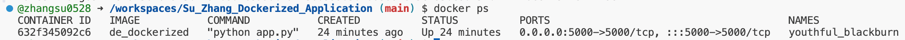
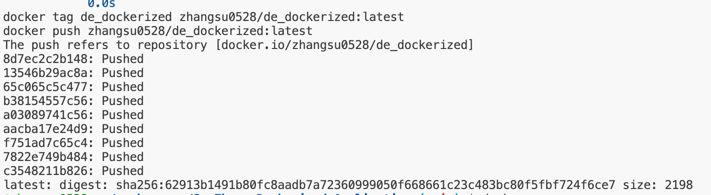
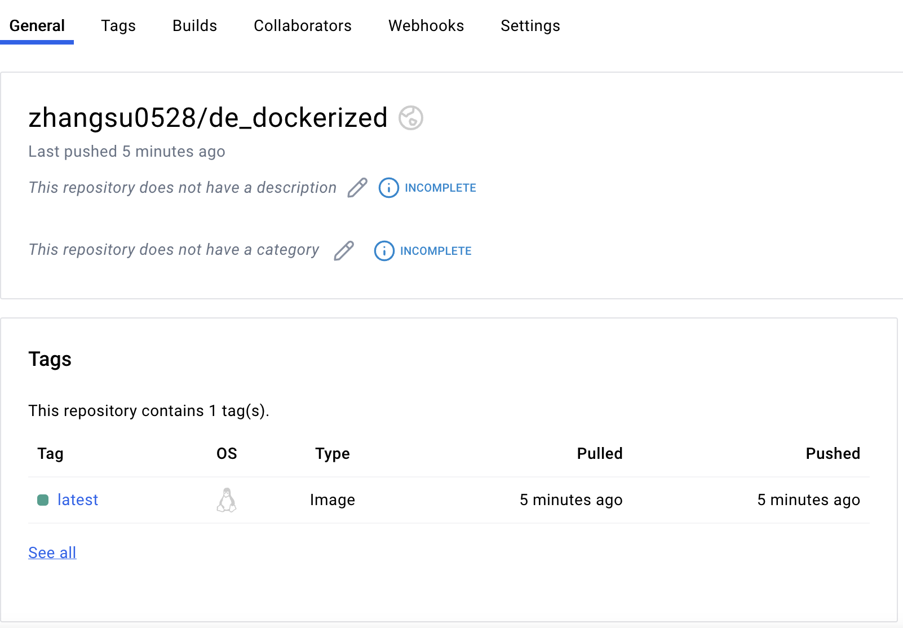
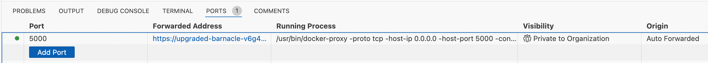

[](https://github.com/nogibjj/Su_Zhang_Dockerized_Application/actions/workflows/build.yml)

# Su_Zhang_Dockerized_Application

# Dockerized Chat Application

A simple chat application built with `Flask` and `containerized using Docker`. This project demonstrates Docker containerization, CI/CD pipeline integration with GitHub Actions, and deployment to `Docker Hub`.

## Project Overview

This application provides a simple chat interface where users can:
- Send messages
- View chat history
- Access the application through a web browser

## Project Structure

```
.
├── app.py              # Flask application
├── Dockerfile          # Docker configuration
├── requirements.txt    # Python dependencies
├── templates/         
│   └── index.html     # Chat interface template
├── Makefile           # Build automation
├── .env               # Environment variables (not shown git)
└── .github/
    └── workflows/
        └── docker-build.yml  # CI/CD configuration
```

## Setup and Installation

1. Clone the repository:
```bash
git clone <repository-url>
cd <repository-name>
```

2. Create `.env` file with your Docker credentials:

* Need to create your docker hub personal token, also important to set the permission scope to **"read, write and delete"**

```
DOCKER_TOKEN=your_docker_token_here
```

3. Build and run the application:
```bash
make dev
```

4. Check if the container successfully runs:
```bash
make container_show
```
or can use:

```bash
docker ps
```

If successfully running, you should see something similar to below:

   


5. Build and push to Docker Hub
```bash
make build
```

If successfully pushed, you should see something similar to below:

   

6. Stop all running containers and clean the docker image:
```bash
make stop
make clean
```

## Available Make Commands

- `make build`: Build Docker image and push to Docker Hub (including login to Docker Hub)
- `make run`: Run the container
- `make stop`: Stop running containers
- `make clean`: Clean up containers and images
- `make logs`: View container logs
- `make container_show`: List running containers
- `make image_show`: List Docker images

## Docker Hub

   

The application is available on Docker Hub through this [link](https://hub.docker.com/repository/docker/zhangsu0528/de_dockerized)

```bash
docker pull zhangsu0528/de_dockerized:latest
```

## Accessing the Application

1. After running `make dev`, the application will be available at:
   - Local: `http://localhost:5000`
   - Codespace: Check the "Ports" tab and use the provided URL

2. If using GitHub Codespaces:
   - Find port 5000 in the Ports tab
   - Set visibility to "Private to Organizations"
   - Use the provided URL to access the application

   
